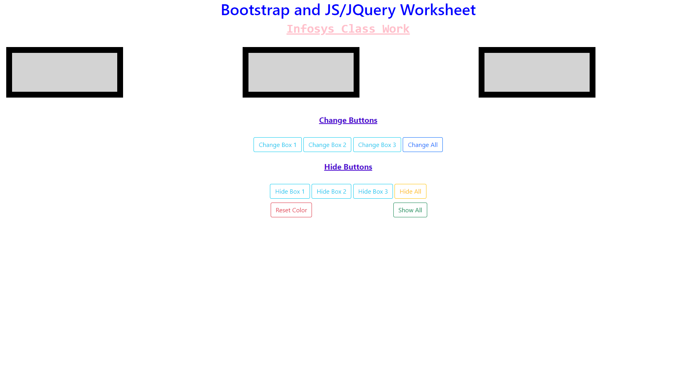

# User Story

As a user, I want to create a web-page to change the color of the boxes individually and all together. In addition, being able to hide boxes individually and all together.

[GitHub repository](https://saravia159.github.io/Bootstrap-Assignment/)

---

# Acceptance Criteria

1. Given that the user clicks on any of the input boxes, the user will be able to change the color of the boxes, hide boxes, reset color, and show all boxes once they are hidden.

